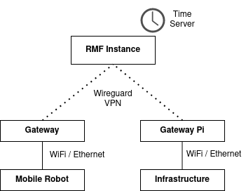

# architecture

The following is an architecture diagram with the important components we will use for an RMF deployment.

The following describes the architecture, and explains the design choices made.

## RMF Instance
The RMF Instance is a computer / [container](https://www.docker.com/resources/what-container) that runs the main "bulk" of RMF. You can think of this as a combination of the [common launch files](https://github.com/open-rmf/rmf_demos/blob/main/rmf_demos/launch/common.launch.xml), [simulations](https://github.com/open-rmf/rmf_demos/blob/main/rmf_demos/launch/simulation.launch.xml), [adapters](https://github.com/open-rmf/rmf_demos/blob/main/rmf_demos/launch/office.launch.xml#L23-L36) and [web tools](https://github.com/open-rmf/rmf-web). For simplicity, we run all these components in the same computer / container, but conceivably, these components could be split up.

To illustrate this, we could change the structure such that certain adapters are run in a secondary computer, which is connected on the same network. 

## Chrony Time Server
The time server is an optional component that could be helpful in your deployment. In general terms, if your devices have internet access, synchronizing time with the internet time servers should be sufficient to make sure your reported time stamps are valid: `timedatectl set-ntp true`.

However, if your deployment scenario does not allow access to the Internet, it is prudent to set up a time server(s) on the RMF instance, and synchronize time to them. Accurate timestamps are important, and chrony is designed to function well even in less than ideal network conditions.

## Wireguard VPN
We recommend setting up a VPN for deployment scenarios. There are a few benefits. First, this helps to reduce the complexity of coordinating IP addresses. Second, encryption helps with security. Third, this architecture is suitable for quick re-deployment onto cloud infrastructure, such as when you want to put RMF instance on AWS EC2. We use [Wireguard](https://www.wireguard.com/) for simplicity in our examples.

## Gateway Pi
We use a Gateway Pi to provide an "abstraction layer" regarding network infrastructure, from the point of view of a robot or infrastructure developer or vendor. The aim is to allow the necessary RMF communications to happen on the Wireguard / Gateway Pi layer. 

To the RMF instance, the Gateway Pi *is* the mobile robot / infrastructure, and communicates as so. To the mobile robot / infrastructure, the RMF instance *is* the Gateway Pi. This helps to simplify networking configuration and reduce the chances of mishaps.

The Gateway Pi can be a separate device, or exist as a modification to the software of the connected system, depending on your constraints. 
